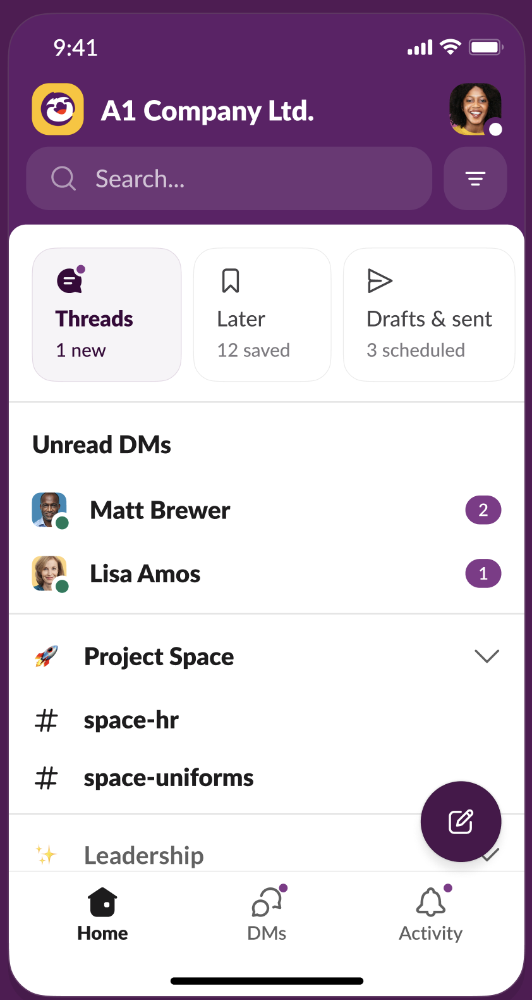
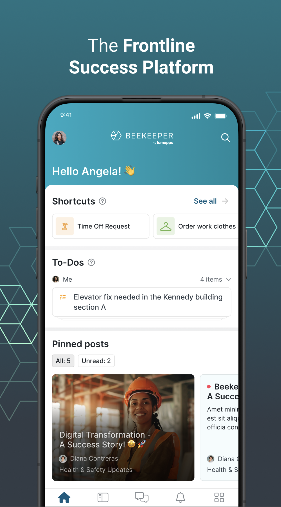
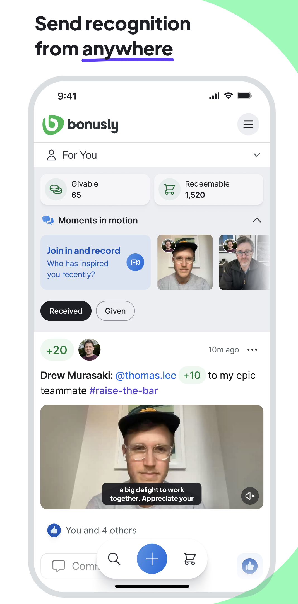

# Market research

Existing products that overlap with the two use cases from `task-info.md`:

1. **Align the workforce and make them feel part of something bigger** (culture / belonging)
2. **Replace WhatsApp for internal 1-to-1 and group communications** (chat)

Each entry notes which use case(s) it covers and what direction it suggests for the POC. Products are intentionally chosen to be distinct from one another rather than near-duplicates.

---

## Slack



**Use case:** (2) chat, with some (1) via channels/Huddles

The default 1-1 and group chat tool for knowledge workers. Organises conversation into channels (persistent, topic- or team-based rooms), threads, DMs, and ad-hoc Huddles (voice). App ecosystem and automations are mature.

- **Strengths:** Channel model scales from 1-1 to company-wide; threads keep context; strong search and history; Huddles add lightweight presence/voice.
- **Weaknesses for hospitality:** Designed for desk workers who sit in front of a laptop all day. Heavy, notification-dense, and assumes always-on attention. Frontline/hourly staff typically won't check it on shift.
- **POC direction it points to:** A channel-based chat model with threads and DMs, but with a mobile-first, low-friction surface tailored to shift workers.

## Beekeeper



**Use case:** (1) + (2) — explicitly built for frontline/non-desk workers, including hospitality

A frontline employee communication platform. Combines 1-1 and group chat with top-down "streams" (broadcasts from leadership), surveys, polls, and a company directory. Targets industries like hospitality, manufacturing, and retail where staff don't have corporate email.

- **Strengths:** Purpose-built for the audience in the brief. Streams directly address use case (1) — making staff feel connected to something bigger. Chat covers use case (2). Identity isn't tied to email.
- **Weaknesses:** Broad feature surface can feel enterprise-heavy; less focused on the casual, conversational feel of WhatsApp that staff are used to.
- **POC direction it points to:** A chat app with a parallel "broadcast/leadership stream" layer for culture and alignment, plus identity by phone number (not email).

## Bonusly



**Use case:** (1) only — peer recognition and culture, no chat

A peer-to-peer recognition platform where employees give each other small public "bonus" shout-outs tied to company values. Feeds, leaderboards, and redeemable rewards. No 1-1 or group messaging.

- **Strengths:** A clean, focused answer to use case (1). Shows that "alignment and belonging" can be its own product surface, not just a feature of a chat app.
- **Weaknesses:** Doesn't address chat at all, so it can't replace WhatsApp on its own.
- **POC direction it points to:** Treat culture/belonging as a first-class feed (recognition, shout-outs, values) that exists alongside — or even instead of — chat.

## Additional ways to create culture / belonging

Ideas for use case (1) that the products above don't already cover:

- **Performance metrics surfacing**: surface positive store and company-level metrics to staff — "Your site is in the top 10% of performers this month", "Sales up 18% vs last month", "Best week of the quarter." Frontline staff rarely see the business impact of their work; tying effort to outcomes makes them feel part of something bigger. None of the surveyed products surface business performance to the frontline. One concern with this is how to handle metrics if the performance is reducing - will it be disincentiving to see poor metrics if the company is struggling / underperforming?
- **Guest feedback piped in**: when a positive review or guest compliment names a staff member, surface it in the app (e.g. a "Guest shout-outs" feed). Hospitality staff almost never see the downstream impact they had on a guest. Distinct from peer recognition (Bonusly) because it comes from the customer, not a colleague, and reinforces the *purpose* of the job. The challenge with this is how do you collect those reviews? Can you build a scraper for common review sites?
- **Site-vs-site leaderboards / friendly rivalry**: rank sites on metrics that matter (guest scores, cleanliness audit, upsell revenue) and let sites see where they stand vs the rest of the company. Borrowed loosely from Discord's identity/tribe mechanic, but grounded in real performance rather than consumer community. Gives staff a team to root for that isn't just "the company".
- **Milestones & tenure**: celebrate work anniversaries, birthdays, "100th shift", completed training. Cheap to implement (data already exists in HR/scheduling) and consistently lands well with hourly staff. The surveyed comms tools don't emphasise this.
- **Shift handover narrative**: a lightweight, auto-curated "what happened on the last shift" note so staff arriving feel continuity with the team they never overlap with. Builds belonging across a fragmented, shift-based workforce — a structural problem unique to hospitality that none of the surveyed products address.
- **Career progression visibility**: surface who got promoted, who completed training, open internal roles. Makes "part of something bigger" concrete by showing a path forward. Connecteam touches training but not the *narrative* of growth.
- **Personalised coach**: using data from chats, plus work schedules, overtime data and demand modelling, give shift specific AI guidance to each team member ahead of their shift (daily plus weekly review)
---

## Mapping to POC direction

The products above cluster into a few distinct directions for a first version:

| Direction | Exemplars | What the POC would lead with |
|---|---|---|
| **Chat-first (WhatsApp replacement)** | Slack | Channels + DMs + threads, mobile-first, identity by phone |
| **Frontline comms platform** | Beekeeper | Chat + leadership broadcast stream, phone-number identity |
| **Belonging-first** | Bonusly | Persistent spaces / recognition feed as the core, chat secondary |

These are not mutually exclusive, but a half-day POC should pick one as the spine and at most nod to the others.

## Decided direction to explore

Chat (group plus 1-1) is a basic core that needs to be in any POC. Leaning heavily into this would mean adding additional functionality like emoji reactions, threads, announcement only channels and permissions.

I think it is however more interesting and powerful to offer something different than what Whatsapp already does, and so more compelling to have a basic chat (that is expandable in the future), but add ontop of that the belonging piece tailored to the use case. Of the ideas explored above, I think the most compelling piece that would drive frequent adoption of the app is the AI personalised coach.

--

Inital generation from prompt:

```
Given the information in docs/task-info.md, create another md file in docs called market-research, and add distinct existing products that already exist in the space of the task (for example slack is a well known existing group and 1-1 chat). The goal is to add examples of existing applications that cover the 2 use cases (either separately or together) to decide what direction to go with the POC. Don't add examples that are very similar to each other (e.g. if you add slack don't also add microsoft teams).
```
